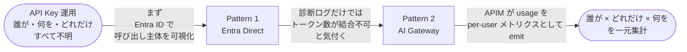
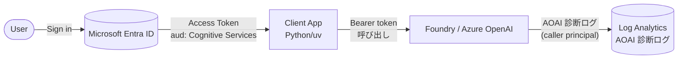
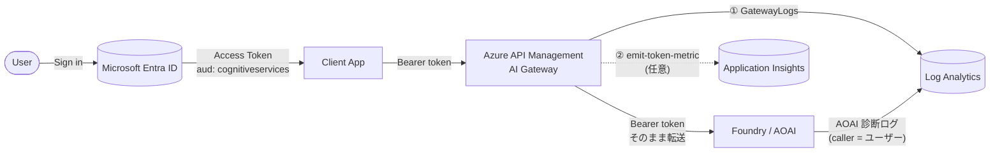
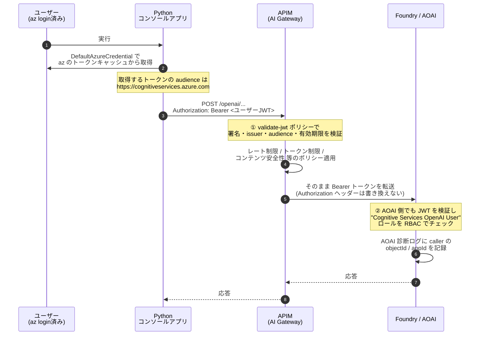
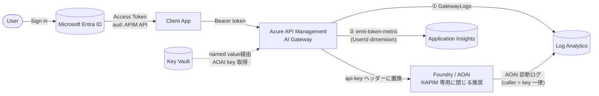
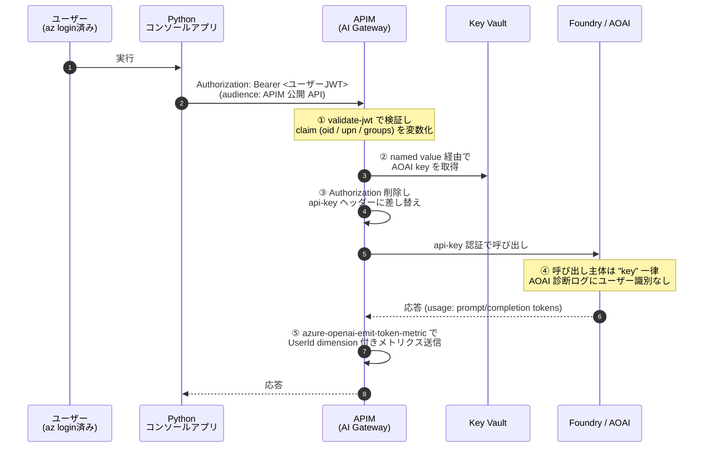
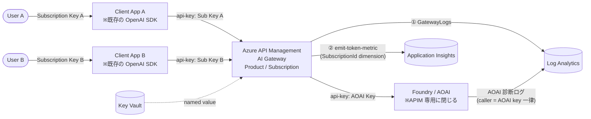
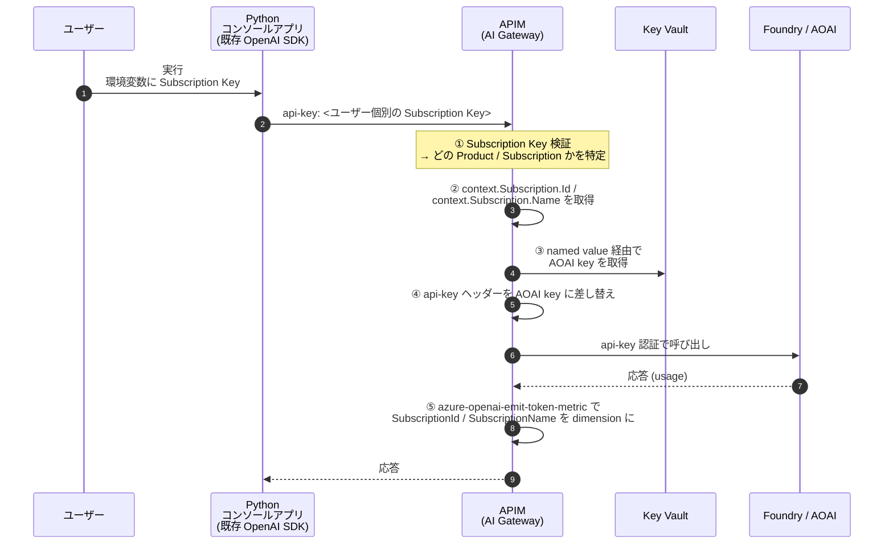
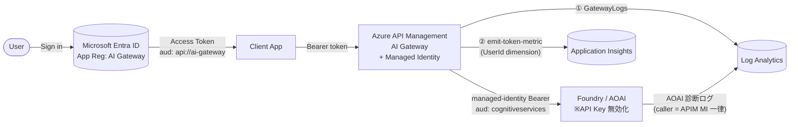
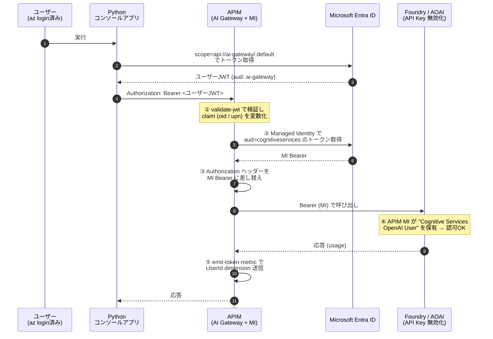

# Microsoft Foundry / Azure OpenAI ユーザー別利用状況トラッキング ハンズオン

Microsoft Foundry Models（Azure OpenAI 等）を **ユーザー単位で利用状況を把握** するためのハンズオン集です。

## 解きたい課題

多くの現場では、Azure OpenAI / Foundry Models を **API キー方式** で呼び出しているため、次のような問題が起きます。

- 「誰が」「どのモデルを」「どれくらい」使ったのか分からない
- 部門別・ユーザー別のコスト按分や利用統制ができない
- キーが漏えいした際の影響範囲を特定できない
- Conditional Access / RBAC / 監査ログといった既存ガバナンス基盤と切り離されている

### Before / After

| | ❌ Before（API Key モデル） | ✅ After（Entra ID + AI Gateway） |
|---|---|---|
| **可視化** | 「使った量」は見えるが「使った人」は見えない | 「誰が・何を・どれくらい」が追える |
| **統制単位** | アプリ単位 / キー単位の集計のみ | ユーザー / 部門 / グループ単位の按分・統制 |
| **責任** | 不正利用・コスト責任の所在が曖昧 | 監査ログベースで説明責任が成立 |
| **既存統制** | Conditional Access / 監査基盤と切り離し | Entra ID / Conditional Access / RBAC と統合 |
| **キー漏えい** | 漏れたら全社影響、ローテーションも全体に波及 | キーレス運用（Pattern 2D）で **物理的に存在しない** |

> **CISO 向けメッセージ**: AI を「API」ではなく **"Identity 付き Workload"** として扱う。

このリポジトリでは、これらの課題を解決する **2 系統・全 5 パターン** をハンズオン形式で順を追って体験できます。

- **Pattern 1（APIM なし）** — Entra ID で AOAI を直接叩く。**概要・原理理解** のための最小構成
- **Pattern 2（APIM あり：AI Gateway 戦略） ★本命** — APIM を AI Gateway として導入し、用途に応じて 4 通り（**2A / 2B / 2C / 2D**）の実装を比較

---

## ハンズオンのストーリーライン — 「誰が」から「どれだけ」へ

本ハンズオンは、**1 つの問いを 2 段階で解いていく** 構成です。



| ステップ | 担当パターン | 答えられる問い | 取れる粒度 |
|---|---|---|---|
| **Step 1** | Pattern 1（Entra Direct） | **Q1: 「誰が」叩いたか？** | per-user の **呼び出し回数** のみ（AOAI 診断ログから集計） |
| **Step 2** | Pattern 2A / 2B / 2C / 2D（AI Gateway） | **Q2: 「誰が」「どれだけ」使ったか？** | per-user × per-call の **prompt / completion / total トークン数**（APIM の `azure-openai-emit-token-metric` で集計） |

**Pattern 1 → Pattern 2 への動機付け**：

- Pattern 1 で「Entra ID 直結なら **呼び出し主体（oid）は AOAI 診断ログに記録される**」ことを実機確認できる ✅
- しかし同じ AOAI 直結構成では、**トークン数を持つログ（`AzureOpenAIRequestUsage`）と caller identity を持つログ（`RequestResponse`）を結合する手段が事実上ない** ❌（詳細は Pattern 1 README §6）
- → ここで「**AI Gateway（APIM）が必要な理由**」が腹落ちする。APIM の `azure-openai-emit-token-metric` ポリシーは **AOAI レスポンスの `usage` を per-user dimension 付きカスタムメトリクスとして emit** できるため、Q2 の答えになる

> **ハンズオン教材としての立て付け**: まず Pattern 1 で **「Q1 は解けるが Q2 が解けない痛み」** を体感してから、Pattern 2 で **「AI Gateway が Q2 を解く仕組み」** を 4 つの認証バリエーション（2A / 2B / 2C / 2D）で比較するのが推奨ルートです。

---

## ハンズオンで扱うパターン

| # | パターン | クライアント → APIM | APIM → AOAI | per-user 集計の主役 | 位置づけ |
|---|---|---|---|---|---|
| **1** | Entra ID 直結 + AOAI 診断ログ | —（直接 AOAI） | — | AOAI 診断ログ（LA） ⚠️ **per-user × per-token は構造的に不可、呼び出し回数まで** | 学習用・原理理解（実運用不可） |
| **2A** | AI Gateway: Bearer パススルー | Entra Bearer (`aud=AOAI`) | 同じ Bearer を転送 | **AOAI 診断ログ**（LA）＋APIM 2系統ログ | Gateway 導入の最初の一歩 |
| **2B** | AI Gateway: Entra → AOAI Key | Entra Bearer (`aud=APIM`) | AOAI Key (Key Vault) | **APIM 2系統ログ**（GatewayLogs → LA / `emit-token-metric` → AI） | 全社共通 AOAI を複数アプリで共有 |
| **2C** | AI Gateway: per-user Subscription Key | **APIM Subscription Key**（ユーザー毎に発行） | AOAI Key (Key Vault) | **APIM 2系統ログ**（Subscription dim） | 既存キー前提クライアントを変えずに「誰が」を取る現実解 |
| **2D ★** | **AI Gateway: Entra + APIM Managed Identity** | Entra Bearer (`aud=api://ai-gateway`) | **APIM Managed Identity**（キーレス） | **APIM 2系統ログ**（UserId dim） | **AI Gateway 思想のゴール**。キーレス・MI・Entra で完結 |

> **⚠️ APIM のロギングは常に 2 系統**　—　どのパターンでも APIM は「① **診断ログ（GatewayLogs）→ Log Analytics**」と「② **Application Insights（`<diagnostic>` トレース + `azure-openai-emit-token-metric` カスタムメトリクス）**」の 2 ストリームを同時に使うのが前提。Pattern 2B/2C/2D では **② が per-user トークン集計の主役**（AOAI 側が key/MI 一律に見えるため）。

各パターンは **独立した `azd` プロジェクト** として構成されており、興味のあるパターンだけを単独で試せます。

---

## OpenAI SDK との互換性

ハンズオンのサンプルアプリはすべて Python の **公式 `openai` パッケージ（`AzureOpenAI` クラス）をそのまま使う** ことを前提としています。**SDK を fork したり独自 HTTP クライアントを書く必要はありません**。

| # | クライアント側コードの書き方 | SDK 素のまま？ |
|---|---|---|
| 1 | `AzureOpenAI(azure_ad_token_provider=...)`<br/>scopes=`https://cognitiveservices.azure.com/.default` | ◎ |
| 2A | `AzureOpenAI(azure_ad_token_provider=..., azure_endpoint=<APIM>/openai)`<br/>scopes は AOAI と同じ | ◎ エンドポイント差し替えのみ |
| 2B | 同上、scopes=`api://<apim-app>/.default` | ◎ scope のみ変更 |
| 2C | `AzureOpenAI(api_key=<APIM Subscription Key>, azure_endpoint=<APIM>/openai)` | ◎ **※APIM 側で 1 行設定** が必要（下記） |
| 2D ★ | `AzureOpenAI(azure_ad_token_provider=..., azure_endpoint=<APIM>/openai)`<br/>scopes=`api://<ai-gateway>/.default` | ◎ 2B と同じ |

### Pattern 2C で必要な APIM 側の設定

APIM の Subscription Key はデフォルトでヘッダ `Ocp-Apim-Subscription-Key` で受け取りますが、`AzureOpenAI` SDK は AOAI 仕様の `api-key` ヘッダで送ります。APIM の API リソース定義で **Subscription Key のヘッダ名を `api-key` に変更** すれば、SDK は **AOAI 直叩きと完全に同じコード** で動作します（`default_headers` のハックは不要）。

```bicep
// APIM API リソース
properties: {
  subscriptionRequired: true
  subscriptionKeyParameterNames: {
    header: 'api-key'    // ← AOAI 互換ヘッダ名にする
    query:  'api-key'
  }
}
```

> 結論: **全パターンで `AzureOpenAI()` 一発**で書けます。差分は「クレデンシャルの渡し方」と「`azure_endpoint`」のみ。

---

### Pattern 1: Entra ID + AOAI 診断ログ（APIM なし／概要・原理理解）

> **このパターンで答える問い**: **Q1「誰が」叩いたか？** ✅　/　**Q2「どれだけ」使ったか？** ❌（次の Pattern 2 で解く）



- **やること**: API キーを廃止し、Entra ID トークンで Foundry を呼び出す。AOAI 診断ログ / メトリクスを Log Analytics に流して「**Q1 は解けるが、AOAI 直結のままでは Q2 が解けない**」ことを実機で体感する
- **強み**: 構成がシンプル、追加コンポーネントが少ない
- **⚠️ 重要な制約**: 実機検証の結果、この構成では **「誰が」×「どれだけトークンを使ったか」を結合した集計は構造的に不可能** です。詳細は Pattern 1 の README §6 を参照。要点は以下の 3 点です。
  - `RequestResponse` カテゴリ: caller identity あり / トークン数 **なし**（`requestLength` / `responseLength` は bytes）
  - `AzureOpenAIRequestUsage` カテゴリ: 両方持つ設計だが **本検証では emit されず**、ハンズオン教材として安定しない
  - `AzureMetrics`: トークン数あり / **caller ディメンションなし**（テナント全体単位の集計のみ）
- **実運用への推奨パス**: per-user × per-token を本気で取るなら、初めから **Pattern 2A / 2B / 2C / 2D （APIM を AI Gateway として導入）** を選んでください
- **ハンズオン手順 / KQL / トラブルシュート / 構造的限界の詳細**: 👉 [`pattern-1-entra-direct/README.md`](./pattern-1-entra-direct/README.md)

---

### Pattern 2: AI Gateway 戦略 ★本命 — APIM を AI Gateway として導入

> **このパターン群で答える問い**: **Q2「誰が」「どれだけ」使ったか？** ✅（Pattern 1 で残ったトークン数 × ユーザーの結合を、APIM の `azure-openai-emit-token-metric` ポリシーで解決する）

ここからが **本命の AI Gateway 戦略** です。Azure API Management（以下 APIM）を AOAI の前段に置き、**認証・認可・per-user トラッキング・レート制限・コンテンツ安全性・複数モデルのルーティング** を一元化します。

クライアント ↔ APIM 間と APIM ↔ AOAI 間の **2 つの認証ポイント** をどう設計するかで、4 つの実装パターン（**2A / 2B / 2C / 2D**）に分岐します。

| サブパターン | クライアント → APIM | APIM → AOAI | 想定シナリオ |
|---|---|---|---|
| **2A**: Bearer パススルー | Entra Bearer | 同じ Bearer を転送 | クライアント／ユーザーに AOAI への RBAC を配布できる |
| **2B**: Entra → AOAI Key | Entra Bearer | AOAI Key | 全社共通 AOAI を複数アプリ／部門で共有、AOAI 側 RBAC を配布したくない |
| **2C**: per-user Subscription Key | APIM Subscription Key（per user） | AOAI Key | 既存キー文化の延長で、まず「誰が」を取り始めたい |
| **2D ★**: Entra + APIM MI | Entra Bearer | **APIM Managed Identity** | **キーレス**運用の最終形。AI Gateway 思想のゴール |

#### 共通：APIM 入口での Entra ID 認証（2A / 2B / 2D）

クライアントが Entra Bearer を持ってくる 2A / 2B / 2D では、APIM の inbound で必ず `validate-jwt` を実行します。素通しせず必ず APIM 側で検証するメリットは次の通りです。

1. **不正トークンを AOAI まで到達させない** — 失効・改ざんトークンを APIM で落とすことで AOAI のクォータと課金を守る
2. **テナント・オーディエンス・スコープを強制** — 想定外のテナントやスコープのトークンを排除（マルチテナントリーク防止）
3. **claim を後続ポリシーで活用** — `validate-jwt` で抽出したユーザー identity（`oid` / `preferred_username` / `groups`）を、レート制限・`emit-token-metric` の dimension 等で再利用できる

---

#### Pattern 2A: Bearer パススルー方式

##### 概要



##### 認証の詳細フロー（APIM と AOAI の二段階認証）



##### APIM ポリシーの最小実装

```xml
<inbound>
  <base />
  <!-- ① ユーザーJWTを検証（audience は AOAI 用） -->
  <validate-jwt header-name="Authorization" failed-validation-httpcode="401">
    <openid-config url="https://login.microsoftonline.com/{tenant-id}/v2.0/.well-known/openid-configuration" />
    <audiences>
      <audience>https://cognitiveservices.azure.com</audience>
    </audiences>
  </validate-jwt>

  <!-- ② Authorization ヘッダーはそのまま AOAI に転送（書き換えない） -->
  <set-backend-service base-url="https://{your-aoai}.openai.azure.com" />
</inbound>
```

ポイントは **`set-header name="Authorization"` を書かない** こと。受信したユーザー Bearer トークンがそのまま AOAI に届き、AOAI 診断ログに **ユーザー identity が記録** されます。

##### per-user 集計の取得元（APIM のロギングは 2 系統）

Pattern 2A では **一次情報は AOAI 側**だが、APIM も以下の 2 系統ログを補助的に有効化しておくとよい。

| 系統 | バックエンド | 役割 |
|---|---|---|
| **① 診断ログ（GatewayLogs）** | Log Analytics | リクエスト単位の監査（メソッド/URL/ステータス/レイテンシ、`validate-jwt` 後の claim を `set-header` で付加して保存も可） |
| **② Application Insights** | Application Insights | `<diagnostic>` ポリシーによる詳細トレース。`azure-openai-emit-token-metric` の per-user カスタムメトリクスもこちらに emit（このパターンでは任意） |

- **AOAI 診断ログ**（Log Analytics）が一次情報（`Identity` = ユーザーの `objectId`）
- 上記 APIM 2 系統をそろえておくと、ログ欠損時の冗長性・事後調査でのトレーサビリティが一気に高まる

##### 必要な権限設計

- 利用ユーザー（または所属グループ）に **`Cognitive Services OpenAI User`** ロールを AOAI リソーススコープで割り当てる
- APIM の Managed Identity に AOAI ロールは **不要**（APIM は転送するだけ）
- **詳細**: `pattern-2a-apim-passthrough/README.md`

---

#### Pattern 2B: Entra → AOAI Key 変換方式

##### 概要



##### 認証の詳細フロー



##### APIM ポリシーの最小実装

```xml
<inbound>
  <base />
  <!-- ① ユーザーJWT検証（audience は APIM 公開 API 用） -->
  <validate-jwt header-name="Authorization" failed-validation-httpcode="401">
    <openid-config url="https://login.microsoftonline.com/{tenant-id}/v2.0/.well-known/openid-configuration" />
    <audiences>
      <audience>api://your-apim-app</audience>
    </audiences>
  </validate-jwt>

  <!-- ② claim を変数化（後段の token-metric で dimension に使う） -->
  <set-variable name="userId"
    value="@(context.Request.Headers.GetValueOrDefault(&quot;Authorization&quot;,&quot;&quot;).AsJwt()?.Claims.GetValueOrDefault(&quot;oid&quot;,&quot;&quot;))" />
  <set-variable name="userUpn"
    value="@(context.Request.Headers.GetValueOrDefault(&quot;Authorization&quot;,&quot;&quot;).AsJwt()?.Claims.GetValueOrDefault(&quot;preferred_username&quot;,&quot;&quot;))" />

  <!-- ③ ユーザーJWTを削除し、AOAI key に差し替え -->
  <set-header name="Authorization" exists-action="delete" />
  <set-header name="api-key" exists-action="override">
    <value>{{aoai-key-from-keyvault}}</value>  <!-- named value (Key Vault 参照) -->
  </set-header>

  <set-backend-service base-url="https://{your-aoai}.openai.azure.com" />
</inbound>

<outbound>
  <base />
  <!-- ⑤ per-user メトリクスを App Insights / LA に emit -->
  <azure-openai-emit-token-metric namespace="openai-usage">
    <dimension name="UserId"          value="@((string)context.Variables[&quot;userId&quot;])" />
    <dimension name="UserUpn"         value="@((string)context.Variables[&quot;userUpn&quot;])" />
    <dimension name="ModelDeployment" value="@(context.Request.MatchedParameters.GetValueOrDefault(&quot;deployment-id&quot;,&quot;&quot;))" />
    <dimension name="ApiName"         value="@(context.Api.Name)" />
  </azure-openai-emit-token-metric>
</outbound>
```

##### per-user 集計の取得元（APIM のロギングは 2 系統）

AOAI 側は key 一律で見えないため、**APIM 側の 2 系統ログが唯一の per-user ソース** になる。

| 系統 | バックエンド | per-user 集計での役割 |
|---|---|---|
| **① 診断ログ（GatewayLogs）** | Log Analytics | リクエスト単位の監査ログ。`validate-jwt` で取った `userId` 変数を `set-header` 等で残せば、KQL でユーザー別の **コール回数・エラー率** を集計可 |
| **② Application Insights** | Application Insights | `azure-openai-emit-token-metric` の出力先。**prompt / completion トークン数** を `UserId` dimension 付きカスタムメトリクスとして emit（per-user **コスト按分**の主役） |

- AOAI 診断ログは「APIM 経由・key 認証」一律になり、**ユーザー個別の追跡不可**
- → ① の保持期間・② のカスタムメトリクスサンプリング設計が極めて重要

##### 必要な設計ポイント

- **AOAI を APIM 専用に閉じる** — Private Endpoint + ファイアウォールで他経路をブロックしないと、別経路アクセスを追跡できなくなる
- **AOAI key の管理** — Key Vault に格納し、APIM 側で **named value（Key Vault 参照）** から引く。APIM の Managed Identity に Key Vault の `Key Vault Secrets User` を付与
- **key ローテーション運用** — Key Vault シークレットを更新 → named value を再フェッチ
- 利用ユーザーに AOAI の RBAC ロールは **不要**
- **詳細**: `pattern-2b-apim-key-exchange/README.md`

---

#### Pattern 2C: per-user Subscription Key 方式（既存キー文化の救世主）

##### 概要



##### 認証の詳細フロー



##### APIM ポリシーの最小実装

```xml
<inbound>
  <base />
  <!-- ① Subscription Key の検証は APIM 標準機能（subscriptionRequired=true）。
         API 定義側で subscriptionKeyParameterNames.header = "api-key" にすれば
         クライアントは AOAI 直叩きと完全に同じヘッダ名で送れる -->

  <!-- ② 受信した api-key（=Subscription Key）を AOAI key で上書き -->
  <set-header name="api-key" exists-action="override">
    <value>{{aoai-key-from-keyvault}}</value>
  </set-header>

  <set-backend-service base-url="https://{your-aoai}.openai.azure.com" />
</inbound>

<outbound>
  <base />
  <!-- ⑤ per-user メトリクス（dimension に Subscription を使う） -->
  <azure-openai-emit-token-metric namespace="openai-usage">
    <dimension name="SubscriptionId"   value="@(context.Subscription?.Id ?? &quot;anonymous&quot;)" />
    <dimension name="SubscriptionName" value="@(context.Subscription?.Name ?? &quot;anonymous&quot;)" />
    <dimension name="ProductName"      value="@(context.Product?.Name ?? &quot;anonymous&quot;)" />
    <dimension name="ModelDeployment"  value="@(context.Request.MatchedParameters.GetValueOrDefault(&quot;deployment-id&quot;,&quot;&quot;))" />
  </azure-openai-emit-token-metric>
</outbound>
```

##### per-user 集計の取得元（APIM のロギングは 2 系統）

| 系統 | バックエンド | per-user 集計での役割 |
|---|---|---|
| **① 診断ログ（GatewayLogs）** | Log Analytics | リクエスト監査ログ。`SubscriptionId` / `SubscriptionName` が自動で記録されるため、KQL でユーザー（= Subscription）別のコール数・エラー率を集計 |
| **② Application Insights** | Application Insights | `azure-openai-emit-token-metric` で `SubscriptionId` / `ProductName` を dimension としたカスタムメトリクスを emit（**コスト按分**の主役） |

- 運用上は **1 Subscription = 1 ユーザー or 1 部門 or 1 アプリ** で発行するのがセオリー
- AOAI 診断ログは AOAI key 一律で **ユーザー識別不可**

##### 強み / 弱み

| | 強み | 弱み |
|---|---|---|
| **クライアント** | **改修ゼロ**。既存の `AzureOpenAI(api_key=...)` コードのキーを差し替えるだけ | identity が APIM ドメインに閉じる（Entra ID 連携なし） |
| **運用** | Quota / Rate Limit / 課金按分がすべて Subscription 単位で簡単 | Subscription Key の発行・配布・無効化フローが別途必要（Dev Portal 等） |
| **ガバナンス** | キー単位で停止／更新でき、誰が持っているかは APIM 上で把握可 | Conditional Access / グループ管理から切り離される |

> **位置づけ**: 「Entra ID に踏み込めない現場」でも、まず **「誰が叩いたか」を取り始める** ための現実解。Pattern 2D（Entra + MI）への踏み台としても有効です。

- **詳細**: `pattern-2c-apim-subscription-key/README.md`

---

#### Pattern 2D: AI Gateway: Entra + APIM Managed Identity ★（ゴール）

これが **目指すべき AI Gateway 思想の最終形** です。

- カスタム App Registration「**AI Gateway**」を立て、ユーザーはこれに対して Entra 認証
- APIM は `validate-jwt`（`aud=api://ai-gateway`）でユーザー JWT を検証し、claim を変数化
- **APIM → AOAI は APIM の Managed Identity で呼び出し**（Entra Bearer、`aud=cognitiveservices`）
- AOAI 側で **API Key は無効化** し、APIM MI に `Cognitive Services OpenAI User` ロールを付与
- per-user 集計は APIM の `emit-token-metric` に user claim を dimension として乗せる

##### 概要



##### 認証の詳細フロー



##### APIM ポリシーの最小実装

```xml
<inbound>
  <base />
  <!-- ① ユーザーJWT検証（audience は AI Gateway App Reg） -->
  <validate-jwt header-name="Authorization" failed-validation-httpcode="401">
    <openid-config url="https://login.microsoftonline.com/{tenant-id}/v2.0/.well-known/openid-configuration" />
    <audiences>
      <audience>api://ai-gateway</audience>
    </audiences>
  </validate-jwt>

  <!-- ② claim を変数化（dimension に使う） -->
  <set-variable name="userId"
    value="@(context.Request.Headers.GetValueOrDefault(&quot;Authorization&quot;,&quot;&quot;).AsJwt()?.Claims.GetValueOrDefault(&quot;oid&quot;,&quot;&quot;))" />

  <!-- ③ APIM の Managed Identity で AOAI 用 Bearer を取得し、Authorization を差し替え -->
  <authentication-managed-identity
      resource="https://cognitiveservices.azure.com"
      output-token-variable-name="msi-access-token"
      ignore-error="false" />
  <set-header name="Authorization" exists-action="override">
    <value>@("Bearer " + (string)context.Variables["msi-access-token"])</value>
  </set-header>

  <set-backend-service base-url="https://{your-aoai}.openai.azure.com" />
</inbound>

<outbound>
  <base />
  <azure-openai-emit-token-metric namespace="openai-usage">
    <dimension name="UserId"          value="@((string)context.Variables[&quot;userId&quot;])" />
    <dimension name="ModelDeployment" value="@(context.Request.MatchedParameters.GetValueOrDefault(&quot;deployment-id&quot;,&quot;&quot;))" />
  </azure-openai-emit-token-metric>
</outbound>
```

##### Pattern 2B との対比

| | **2B**（Entra → Key） | **2D ★**（Entra + MI） |
|---|---|---|
| APIM → AOAI 認証 | AOAI Key（Key Vault 経由） | APIM Managed Identity |
| Key 運用 | ローテーション・KV 更新が必要 | **不要**（キーそのものが存在しない） |
| AOAI 側 API Key | 有効化＋Key Vault 連携 | **無効化** |
| AOAI 側 RBAC | 不要 | APIM MI に `Cognitive Services OpenAI User` |
| Key 漏えいリスク | 残る | **物理的に存在しない** |
| Best Practice 適合 | △ | ◎ |

##### 必要な設計ポイント

- **AOAI の API Key を無効化** し、RBAC のみで認可 — 「キーレス」を強制
- **AOAI を APIM 専用に閉じる** — Private Endpoint + ファイアウォール（Pattern 2B と同じ）
- **APIM の Managed Identity** に AOAI スコープで `Cognitive Services OpenAI User` を付与
- カスタム App Registration「AI Gateway」を Entra に作成し、`api://ai-gateway` の Application ID URI と必要な App Role / Scope を定義
- **詳細**: `pattern-2d-apim-entra-mi/README.md`

---

#### Pattern 2A / 2B / 2C / 2D の比較

| | **2A**<br/>Bearer パススルー | **2B**<br/>Entra → Key | **2C**<br/>Subscription Key | **2D ★**<br/>Entra + MI |
|---|---|---|---|---|
| クライアント → APIM | Entra Bearer | Entra Bearer | APIM Subscription Key | Entra Bearer |
| クライアントの認証実装 | 必要（MSAL / azure-identity） | 必要 | **不要**（既存キー差し替えのみ） | 必要 |
| APIM → AOAI 認証 | 同じ Bearer | AOAI Key | AOAI Key | **APIM MI（キーレス）** |
| AOAI Key の存在 | 不要 | 必要（KV 管理） | 必要（KV 管理） | **不要・無効化** |
| AOAI 側 RBAC 配布 | ユーザー／グループ | 不要 | 不要 | APIM MI のみ |
| AOAI 側 identity | **ユーザー本人** | Key 一律 | Key 一律 | APIM MI 一律 |
| per-user 集計の主役 | AOAI 診断 + APIM | **APIM のみ** | **APIM のみ**（Sub Key） | **APIM のみ** |
| Entra ID 連携 | ◎ | ◎ | ✕ | ◎ |
| Key 漏えいリスク | なし | あり | あり | **物理的になし** |
| 実装の複雑さ | 低 | 中 | **最も低** | 中〜高 |
| 位置づけ | Gateway 導入の最初の一歩 | 全社共通 AOAI 共有 | 既存キー資産の救世主 | **AI Gateway ゴール** |

---

## リポジトリ構成

```
.
├── AGENTS.md                          # エージェント向け運用ルール
├── README.md                          # 本ドキュメント
├── pattern-1-entra-direct/            # Pattern 1: Entra ID 直結（APIM なし）
│   ├── azure.yaml
│   ├── infra/                         # Bicep (AVM)
│   ├── app/                           # Python サンプル (uv)
│   └── README.md
├── pattern-2a-apim-passthrough/       # Pattern 2A: Bearer パススルー
│   ├── azure.yaml
│   ├── infra/
│   ├── app/
│   └── README.md
├── pattern-2b-apim-key-exchange/      # Pattern 2B: Entra → AOAI Key
│   ├── azure.yaml
│   ├── infra/                         # APIM + Key Vault + AOAI(Private)
│   ├── app/
│   └── README.md
├── pattern-2c-apim-subscription-key/  # Pattern 2C: per-user Subscription Key
│   ├── azure.yaml
│   ├── infra/                         # APIM + Key Vault + AOAI(Private)
│   ├── app/
│   └── README.md
└── pattern-2d-apim-entra-mi/          # Pattern 2D ★: Entra + APIM Managed Identity
    ├── azure.yaml
    ├── infra/                         # APIM(MI) + AOAI(API Key 無効化, Private)
    ├── app/
    └── README.md
```

**設計方針**: パターンごとに `azd` プロジェクトを分離しています。受講者は試したいパターンのディレクトリに移動して `azd up` するだけで、そのパターンに必要な最小限のリソースだけがデプロイされます。

---

## 前提条件

### 想定するハンズオン実行環境

本リポジトリのハンズオンは、以下の利用シナリオを前提に設計されています。

- **実行端末**: 受講者の **ローカル PC**（Windows / macOS / Linux）から実行します
- **Entra ID 認証**: **`az login` でサインインしたユーザー ID** をそのまま利用します。アプリ側では `DefaultAzureCredential`（azure-identity）が `az` のトークンキャッシュを自動的に拾い、ブラウザでの追加サインインや MSAL の Device Code フローは不要です
- **サンプルアプリ**: **Python のコンソールアプリ**（CLI スクリプト）として提供します。Web アプリ・サーバーホスティング・コンテナ実行は不要です
- **想定フロー**:

   ```text
   1. az login --tenant <YOUR_TENANT_ID>      # ブラウザで Entra ID にサインイン
   2. az account set --subscription <SUB_ID>  # 利用するサブスクリプションを指定
   3. cd pattern-X-...                        # 試したいパターンのディレクトリへ
   4. azd up                                  # インフラを provisioning
   5. uv run python app/main.py               # コンソールアプリで Foundry を呼ぶ
   6. Log Analytics の KQL で「誰が使ったか」を確認
   ```

> **Note**: `az login` で取得したトークンが Foundry / Azure OpenAI の **データプレーン呼び出し** に使われ、そのユーザー principal が AOAI 診断ログに記録される、という流れがこのハンズオンの核です。

### 必要なツール・権限

| 区分 | 項目 | 用途 |
|---|---|---|
| ツール | [Azure CLI (`az`)](https://learn.microsoft.com/cli/azure/install-azure-cli) | **Entra ID へのサインイン (`az login`)** とサブスクリプション操作。サンプルアプリの認証もここで取得したトークンを利用 |
| ツール | [Azure Developer CLI (`azd`)](https://learn.microsoft.com/azure/developer/azure-developer-cli/install-azd) | インフラ provisioning とアプリデプロイ |
| ツール | [Bicep CLI](https://learn.microsoft.com/azure/azure-resource-manager/bicep/install) | IaC（`azd` 経由で自動実行されるため明示的なインストールは通常不要） |
| ツール | [Python](https://www.python.org/downloads/) **3.11 以上** | コンソール版サンプルアプリの実行 |
| ツール | [uv](https://docs.astral.sh/uv/) | Python 仮想環境・依存管理（`pip` / `poetry` / `conda` は使用しません） |
| Azure | サブスクリプション（**所有者** または **共同作成者 + ユーザーアクセス管理者**） | RBAC ロール割り当てを含むリソース作成に必要 |
| Azure | Foundry / Azure OpenAI のクォータ | 利用したいモデル（例: `gpt-4o-mini`）がデプロイ可能なリージョンであること |
| Entra ID | **アプリ登録の作成権限**（Pattern 2D のみ） | カスタム App Registration「AI Gateway」(`api://ai-gateway`) を作成するために必要 |
| Entra ID | サインイン可能なユーザーアカウント | `az login` で利用するアカウント |

### 事前確認コマンド

ハンズオンを始める前に、以下が通ることを確認してください。

```powershell
az --version                    # Azure CLI が入っているか
azd version                     # azd が入っているか
python --version                # 3.11 以上
uv --version                    # uv が入っているか

az login                        # Entra ID にサインイン
az account show                 # サインインしているテナント / サブスクリプションを確認
```

---

## はじめかた

各パターンのディレクトリに移動して、その中の `README.md` に従ってください。

```powershell
# 例: Pattern 1 を試す場合
cd pattern-1-entra-direct
azd auth login
azd up                # インフラ provisioning + サンプルアプリのデプロイ
# ... ハンズオン手順を実施 ...
azd down --purge      # 後片付け（Key Vault などソフトデリート対象も完全削除）
```

> **重要**: ルート直下では `azd up` できません。**必ずパターンディレクトリに `cd` してから実行** してください。

---

## おすすめの学習順序

各ステップが **ストーリーラインのどの問いを解いているか** を意識しながら進めると、構成判断の根拠が腹落ちしやすくなります。

1. **Pattern 1** から始める（**Q1「誰が」を解く・Q2 が解けない痛みを体感**） — APIM なしの最小構成で、Entra ID 認証と AOAI 診断ログの基本を体感し、**「AOAI 直接では何が取れて何が取れないか」を手を動かして記憶する**（⚠️ 実運用選択肢ではない点を何度も強調）
2. **Pattern 2A** に進む（**Q2「どれだけ」を解く・最も小さい一歩**） — Pattern 1 を APIM 経由に置き換え、Bearer パススルーで「APIM = 認証 + ポリシー + per-user メトリクス emit」「AOAI = 認可 + per-user ログ」の役割分担を体験
3. **Pattern 2B** で「Entra → key 変換」を体験 — 全社共通 AOAI を共有する構成。AOAI 側が key 一律になるため、**Q2 の主役は APIM の `emit-token-metric` のみ** になるトレードオフを理解
4. **Pattern 2C** で「既存キークライアントを変えずに per-user 化」を体験 — Entra ID に踏み込めない現場でも Q1/Q2 を解く現実解
5. **Pattern 2D ★** で締めくくる — Entra + APIM Managed Identity による **キーレス・最終形** の AI Gateway。Q1/Q2 を解きつつ、AOAI Key を物理的に廃止する

---

## ライセンス

[LICENSE](./LICENSE) を参照してください。
