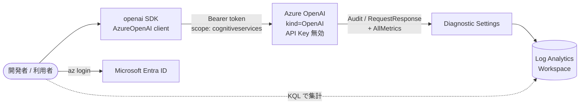

# Pattern 1: Entra ID + Diagnostic Logs (APIM なし)

このパターンは、本リポジトリで扱う「ユーザー単位の Foundry Models 利用量トラッキング」の **概念ベースライン** です。AI Gateway (APIM) を使わず、Azure OpenAI に対して **ユーザー本人の Entra ID トークン** で直接アクセスし、**Azure Monitor 診断ログ** に記録される `identity` (oid / upn) からユーザー別の利用量を集計します。

> ⚠️ Pattern 1 は最小構成です。実運用に近い構成（鍵レス・集約点・レート制限など）は Pattern 2A / 2B / 2C / 2D を参照してください。

---

## 1. アーキテクチャ



**ポイント**

- AOAI は `disableLocalAuth = true` （API Key 無効）に設定。Entra ID トークン以外では呼び出せない
- `DefaultAzureCredential` がユーザーの Entra トークンを取得し、`openai` SDK の `AzureOpenAI(azure_ad_token_provider=...)` 経由でそのまま呼び出す
- AOAI の診断ログ `Audit` / `RequestResponse` には呼び出し元の `identity` (oid, claims) が含まれるため、ユーザー単位で集計可能

---

## 2. 前提条件

| 項目 | 推奨バージョン | 用途 |
| --- | --- | --- |
| [Azure Developer CLI (`azd`)](https://learn.microsoft.com/azure/developer/azure-developer-cli/install-azd) | 1.10+ | プロビジョニング / 環境管理 |
| [Azure CLI (`az`)](https://learn.microsoft.com/cli/azure/install-azure-cli) | 2.60+ | ログイン / KQL 実行 |
| Python | 3.11+ | サンプルアプリ実行 |
| [`uv`](https://docs.astral.sh/uv/) | 0.4+ | Python 依存管理 |

加えて、デプロイ先サブスクリプションで以下が必要です。

- `Microsoft.CognitiveServices` リソースプロバイダーが登録済み
- gpt-4o-mini (GlobalStandard) の TPM クォータが対象リージョンに 10K 以上
- ロール付与のため `Owner` または `User Access Administrator` 権限（自分自身に `Cognitive Services OpenAI User` を付与するため）

---

## 3. デプロイ手順

### 3.1 ログイン

```powershell
azd auth login
az login
```

### 3.2 azd 環境作成

```powershell
cd pattern-1-entra-direct
azd env new aoai-track-dev
```

任意で次の環境変数を上書きできます。

```powershell
azd env set AZURE_LOCATION eastus2
azd env set AZURE_OPENAI_DEPLOYMENT gpt-4o-mini
azd env set AZURE_OPENAI_CAPACITY 10
```

> `principalId` / `principalType` は `azd up` が自動で設定します。

### 3.3 プロビジョニング

```powershell
azd up
```

完了すると以下が作成されます。

- リソースグループ `rg-aoai-track-dev`
- Azure OpenAI アカウント `aoai-<token>` (`disableLocalAuth=true`, gpt-4o-mini デプロイ済み)
- Log Analytics ワークスペース `log-<token>` (保持期間 30 日)
- AOAI → LA への診断設定 (`Audit` / `RequestResponse` / `AllMetrics`)
- 実行ユーザーへの `Cognitive Services OpenAI User` ロール割り当て

### 3.4 (任意) 他ユーザーへロール付与

別の検証ユーザーで動かす場合は、同じロールを付与します。

```powershell
$rg = (azd env get-value AZURE_RESOURCE_GROUP)
$aoaiId = (az cognitiveservices account show -g $rg --query "[0].id" -o tsv) # 単一アカウントの場合
az role assignment create `
  --assignee <USER_OBJECT_ID> `
  --role "Cognitive Services OpenAI User" `
  --scope $aoaiId
```

---

## 4. サンプルアプリ実行

```powershell
# azd の出力を環境変数として現在のシェルにロード
azd env get-values | ForEach-Object {
  if ($_ -match '^(\w+)="?(.*?)"?$') { [Environment]::SetEnvironmentVariable($matches[1], $matches[2]) }
}

cd app
uv sync
uv run python chat.py "Azure OpenAI のメリットを 3 行で教えて"
```

期待する出力例:

```
--- 応答 ---
1. ...
2. ...
3. ...
--- 使用トークン ---
prompt=42 completion=88 total=130
```

`openai` SDK は標準の `AzureOpenAI` クラスをそのまま使用しています。Entra ID トークンは `azure_ad_token_provider` 経由で `DefaultAzureCredential` から自動取得されます。

---

## 5. ユーザー別利用量を KQL で集計

ログが Log Analytics に届くまで通常 2〜5 分かかります。Azure ポータルの **Log Analytics > Logs**、または以下のコマンドで実行します。

```powershell
$workspaceId = (azd env get-value LOG_ANALYTICS_WORKSPACE_NAME)
$rg = (azd env get-value AZURE_RESOURCE_GROUP)
az monitor log-analytics query `
  --workspace (az monitor log-analytics workspace show -g $rg -n $workspaceId --query customerId -o tsv) `
  --analytics-query @query.kql
```

### 5.1 直近 24 時間のユーザー別呼び出し回数

```kusto
AzureDiagnostics
| where ResourceProvider == "MICROSOFT.COGNITIVESERVICES"
| where Category in ("Audit", "RequestResponse")
| where TimeGenerated > ago(24h)
| extend caller = coalesce(
    tostring(parse_json(tostring(properties_s)).identity.claims.upn),
    tostring(parse_json(tostring(properties_s)).identity.claims.oid),
    CallerIPAddress
  )
| summarize calls = count() by caller, bin(TimeGenerated, 1h)
| order by TimeGenerated desc, calls desc
```

### 5.2 ユーザー別トークン消費量（RequestResponse から抽出）

`RequestResponse` ログには `properties.responseBody` 内に `usage.total_tokens` などが含まれます。

```kusto
AzureDiagnostics
| where ResourceProvider == "MICROSOFT.COGNITIVESERVICES"
| where Category == "RequestResponse"
| where TimeGenerated > ago(24h)
| extend props = parse_json(properties_s)
| extend caller = coalesce(
    tostring(props.identity.claims.upn),
    tostring(props.identity.claims.oid)
  )
| extend usage = parse_json(tostring(props.responseBody)).usage
| extend prompt_tokens = toint(usage.prompt_tokens),
         completion_tokens = toint(usage.completion_tokens),
         total_tokens = toint(usage.total_tokens)
| summarize
    calls = count(),
    prompt = sum(prompt_tokens),
    completion = sum(completion_tokens),
    total = sum(total_tokens)
  by caller
| order by total desc
```

> 列名（`properties_s` / `Properties`）はテーブル更新のタイミングで差異が出ることがあります。実環境で `AzureDiagnostics | take 10` を実行し、生の JSON 構造を確認しながら調整してください。

---

## 6. クリーンアップ

```powershell
azd down --purge
```

> `--purge` は Cognitive Services アカウントを完全削除します（ソフトデリート領域もパージ）。

---

## 7. トラブルシュート

| 症状 | 原因 / 対処 |
| --- | --- |
| `401 Unauthorized` (PermissionDenied) | `Cognitive Services OpenAI User` ロールが対象ユーザーに付いていない。`az role assignment list --assignee <oid> --scope <aoai resource id>` で確認 |
| `azd up` で `SpecialFeatureOrQuotaIdRequired` | リージョンを変更 (`azd env set AZURE_LOCATION ...`) するか、対象モデル / SKU のクォータ申請を実施 |
| 診断ログが Log Analytics に出てこない | 数分待つ。`AzureDiagnostics` ではなく `Resource specific` テーブルが有効化されていないかも確認 |
| トークンスコープエラー | `https://cognitiveservices.azure.com/.default` を使用しているか `chat.py` の `COGNITIVE_SERVICES_SCOPE` を確認 |

---

## 8. このパターンの限界 → なぜ Pattern 2 が必要か

- AOAI を全ユーザーに直接公開するため、**レート制限・集約・コスト制御** ができない
- 診断ログは AOAI 側に依存。**カスタム属性（部署 / プロジェクト等）の付与ができない**
- マルチテナント / 非 Entra クライアントに対応できない（Pattern 2C）
- AOAI のキーレス運用は本パターンでも可能だが、**ゲートウェイで一元化された方が監査・ローテーション・ポリシー適用が容易**（Pattern 2D が最終形）

詳しくはトップ [`README.md`](../README.md) を参照してください。
