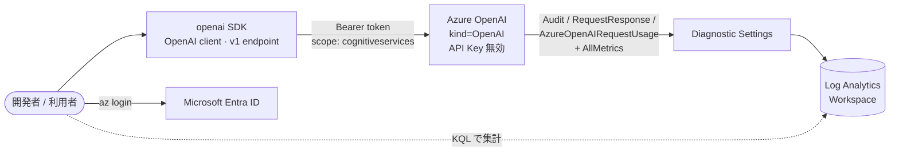
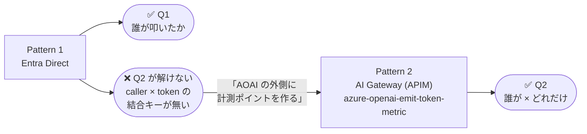

# Pattern 1: Entra ID + Diagnostic Logs (APIM なし)

このパターンは、本リポジトリで扱う「ユーザー単位の Foundry Models 利用量トラッキング」の **概念ベースライン** です。AI Gateway (APIM) を使わず、Azure OpenAI に対して **ユーザー本人の Entra ID トークン** で直接アクセスし、Azure Monitor 診断ログから「誰が呼び出したか」を集計します。
## このパターンで答える問い

本リポジトリのストーリーライン（[トップ README 参照](../README.md#ハンズオンのストーリーライン--誰がからどれだけへ)）における、Pattern 1 の位置付けは次の通りです。

| 問い | Pattern 1 の結果 | 梹概 |
|---|---|---|
| **Q1：「誰が」叩いたか？** | ✅ **解ける** | AOAI 診断ログ `RequestResponse` に `callerObjectId`（ユーザーの Entra oid）が記録される。per-user の **呼び出し回数** を KQL で集計可（§5.1 末尾参照） |
| **Q2：「どれだけ」使ったか？** | ❌ **解けない** | caller identity を持つログと token 数を持つログ/メトリクスに **結合キーが存在しない**（§6 参照）。→ **Pattern 2（AI Gateway）** で解決する |
> ## ⚠️ 重要: このパターンはハンズオンの結論として「実運用には推奨しません」
>
> 本検証の実機計測により、**Pattern 1（Entra Direct）では「誰が」×「どれだけトークンを使ったか」を直接結合できない** ことを確認しました（詳細は [§6 Pattern 1 の構造的限界](#6-pattern-1-の構造的限界--なぜ-pattern-2-が必要か) を参照）。
>
> Pattern 1 は **「Entra ID 直結で AOAI を呼ぶ最小構成」と「AOAI 診断ログ／メトリクスで何が取れて何が取れないか」を体感する学習用** と位置付けてください。実運用での per-user 利用量トラッキングは **Pattern 2A / 2B / 2C / 2D（APIM を AI Gateway として導入）** が現実解です。

---

## 1. アーキテクチャ



**ポイント**

- AOAI は `disableLocalAuth = true` (API Key 無効) に設定。Entra ID トークン以外では呼び出せない
- `DefaultAzureCredential` がユーザーの Entra トークンを取得し、`openai` SDK の **v1 エンドポイント** (`/openai/v1/`) に対して `OpenAI(base_url=..., api_key=token_provider)` で呼び出す
  - v1 エンドポイントは 2025/08 に GA。`api_version` 指定が不要になり、モデル / API バージョン選定から解放される
  - `api_key` に callable (token provider) を渡しているので、SDK が自動でトークンを更新する
- AOAI の診断ログには、呼び出し元の **Entra ID オブジェクト ID (oid)** が記録される。`AzureDiagnostics` はワークスペースごとに動的に列を生やすテーブルのため、oid がどの列に出るかは環境によって変わる（多くは `properties_s` 配下 / `identity_claim_*_g` / `identity_s` などのいずれか）
- ただし **後述の §6 の通り、AOAI 診断ログ／メトリクスのどこを取っても「caller identity と トークン数を結合した per-user 集計」は成立しない** ことが実機検証で判明している。本パターンで取得できるのは **per-user の呼び出し回数（メタデータ集計）** までと理解してハンズオンを進めてほしい

---

## 2. 前提条件

| 項目 | 推奨バージョン | 用途 |
| --- | --- | --- |
| [Azure Developer CLI (`azd`)](https://learn.microsoft.com/azure/developer/azure-developer-cli/install-azd) | 1.10+ | プロビジョニング / 環境管理 |
| [Azure CLI (`az`)](https://learn.microsoft.com/cli/azure/install-azure-cli) | 2.60+ | ログイン / KQL 実行 |
| Python | 3.11+ | サンプルアプリ実行 |
| [`uv`](https://docs.astral.sh/uv/) | 0.4+ | Python 依存管理 |

加えて、デプロイ先サブスクリプションで以下が必要です。

- `Microsoft.CognitiveServices` リソースプロバイダーが登録済み
- gpt-4o-mini (GlobalStandard) の TPM クォータが対象リージョンに 10K 以上
- ロール付与のため `Owner` または `User Access Administrator` 権限（自分自身に `Cognitive Services OpenAI User` を付与するため）

---

## 3. デプロイ手順

### 3.1 ログイン

```powershell
azd auth login
az login
```

### 3.2 azd 環境作成

```powershell
cd pattern-1-entra-direct
azd env new aoai-track-dev
```

任意で次の環境変数を上書きできます。

```powershell
azd env set AZURE_OPENAI_DEPLOYMENT gpt-4o-mini
azd env set AZURE_OPENAI_CAPACITY 10
```

> `principalId` / `principalType` は `azd up` が自動で設定します。

### 3.3 プロビジョニング

```powershell
azd up
```

初回実行時は `azd` が対話的に **サブスクリプション ・ リージョン ・ リソースグループ名** を聞いてきます。事前に固定したい場合は以下のように設定できます。

```powershell
azd env set AZURE_LOCATION eastus2
azd env set AZURE_RESOURCE_GROUP rg-aoai-track-dev
```

> Bicep テンプレートは **リソースグループスコープ** です。リソースグループ自体の作成 / 記録は `azd` が掱んでくれます。

完了すると以下が作成されます。

- Azure OpenAI アカウント `aoai-<token>` (`disableLocalAuth=true`、gpt-4o-mini デプロイ済み)
- Log Analytics ワークスペース `log-<token>` (保持期間 30 日)
- AOAI → LA への診断設定（**4 カテゴリを明示列挙**: `Audit` / `RequestResponse` / `AzureOpenAIRequestUsage` / `Trace`、加えて `AllMetrics`）
  - `categoryGroup: 'allLogs'` ではなく **個別カテゴリを `enabled: true` で明示** している。`allLogs` は将来カテゴリが増えたら自動追従できる反面、`AzureOpenAIRequestUsage` のような **個別カテゴリの enable 状態が一意に判別しづらく**、運用面の追跡性で劣るため
  - なお `AzureOpenAIRequestUsage` カテゴリは本検証では **emit されなかった**（§6 参照）。明示 enable しても流れてこないため、現状は事実上「ハマりどころの確認用」になっている
- 実行ユーザーへの `Cognitive Services OpenAI User` ロール割り当て

### 3.4 (任意) 他ユーザーへロール付与

別の検証ユーザーで動かす場合は、同じロールを付与します。

```powershell
$rg = (azd env get-value AZURE_RESOURCE_GROUP)
$aoaiId = (az cognitiveservices account show -g $rg --query "[0].id" -o tsv) # 単一アカウントの場合
az role assignment create `
  --assignee <USER_OBJECT_ID> `
  --role "Cognitive Services OpenAI User" `
  --scope $aoaiId
```

---

## 4. サンプルアプリ実行

サンプルは `python-dotenv` で `app/.env` を自動ロードします。`azd env get-values` の出力をそのまま `.env` に書き出すのが最も簡単です。

```powershell
cd app
azd env get-values > .env   # AZURE_OPENAI_ENDPOINT などをまとめて .env に保存
uv sync
uv run chat.py "Azure OpenAI のメリットを 3 行で教えて"
```

> `.env` は `.gitignore` 済みです。シェル側で既に環境変数を設定済みの場合は、その値が優先されます (`load_dotenv()` のデフォルト動作)。
> CI / 別シェルで動かす場合は、従来どおり環境変数を直接エクスポートしても構いません。

期待する出力例:

```
--- 応答 ---
1. ...
2. ...
3. ...
--- 使用トークン ---
prompt=42 completion=88 total=130
```

`openai` SDK は公式の `OpenAI` クラスをそのまま利用し、Azure OpenAI の **v1 エンドポイント** (`<endpoint>/openai/v1/`) を叩いています。これにより `api_version` を指定せずに済み、最新モデル / API 機能をそのまま使えます。Entra ID トークンは `api_key` に callable (`get_bearer_token_provider`) を渡すことで SDK が自動リフレッシュします。

---

## 5. ログ・メトリクスで「何が取れるか」を実機確認する

ログが Log Analytics に届くまで通常 2〜5 分かかります。Azure ポータルの **Log Analytics > Logs**、または以下のコマンドで実行します。

```powershell
$rg = (azd env get-value AZURE_RESOURCE_GROUP)
$wsName = (azd env get-value LOG_ANALYTICS_WORKSPACE_NAME)
$wsId = (az monitor log-analytics workspace show -g $rg -n $wsName --query customerId -o tsv)

az monitor log-analytics query --workspace $wsId --analytics-query @query.kql -o json
```

> ⚠️ **本セクションは「per-user × per-token を集計する KQL」を提示しません。** §6 で説明するとおり、**Pattern 1 ではこの組み合わせを成立させる手段が存在しない** ことが本検証で判明したためです。代わりに「何が取れて何が取れないのか」を体感する `getschema` / `take` ベースの探索クエリのみを掲載します。

### 5.1 `RequestResponse` — caller identity は取れる／トークン数は取れない

呼び出しメタデータは `RequestResponse` カテゴリに出ます。`properties_s`（JSON 文字列）には `apiName` / `modelDeploymentName` / `modelName` / `requestLength` / `responseLength` などが入り、**`callerObjectId` として呼び出し元の Entra ID オブジェクト ID も記録されます**。

```kusto
// (a) スキーマを覗く
AzureDiagnostics
| where ResourceProvider == "MICROSOFT.COGNITIVESERVICES"
| where Category == "RequestResponse"
| getschema

// (b) properties_s の生 JSON を 3 件
AzureDiagnostics
| where ResourceProvider == "MICROSOFT.COGNITIVESERVICES"
| where Category == "RequestResponse"
| take 3
| project TimeGenerated, OperationName, properties_s
```

`properties_s` の実例（本リポジトリでの実測）:

```json
{
  "apiName": "OpenAI",
  "requestTime": 17798775404915090,
  "requestLength": 182,
  "responseLength": 1112,
  "objectId": "<USER_OBJECT_ID>",
  "callerObjectId": "<USER_OBJECT_ID>",
  "streamType": "Non-Streaming",
  "modelDeploymentName": "gpt-4o-mini",
  "modelName": "gpt-4o-mini",
  "modelVersion": "2024-07-18"
}
```

- ✅ **`callerObjectId` あり** — 「誰が呼んだか」は分かる
- ❌ **トークン数なし** — `requestLength` / `responseLength` は **バイト長** であってトークン数ではない

つまり `RequestResponse` だけでは **「ユーザー別の呼び出し回数」** までしか集計できません。

#### Pattern 1 の到達点 — Q1「誰が」に答える per-user 呼び出し回数 KQL

以下が **Pattern 1 で安定して出せる唯一の per-user 集計** です。「誰が何回叩いたか」のダッシュボードをここから始められます。

```kusto
// Q1: ユーザー別の呼び出し回数（過去 24h）
AzureDiagnostics
| where TimeGenerated > ago(24h)
| where ResourceProvider == "MICROSOFT.COGNITIVESERVICES"
| where Category == "RequestResponse"
| extend props = parse_json(properties_s)
| extend callerObjectId = tostring(props.callerObjectId),
         modelDeploymentName = tostring(props.modelDeploymentName)
| where isnotempty(callerObjectId)
| summarize CallCount = count() by callerObjectId, modelDeploymentName
| order by CallCount desc
```

これで **Q1（「誰が」叩いたか）は解けました**。ただし `CallCount` は **回数であってトークン数ではない** 点に注意してください。**Q2（「どれだけ」使ったか）はこの KQL では答えられず**、§6 で説明するとおり Pattern 1 の構造では計測不能です。

### 5.2 `AzureOpenAIRequestUsage` — 本検証では emit されなかった

per-call の prompt / completion / total tokens は本来 `AzureOpenAIRequestUsage` カテゴリで提供される設計ですが、**本検証では `enabled: true` で明示有効化しても 30 回以上の chat 呼び出しに対して 1 件も emit されませんでした**（Standard `OpenAI` クライアント／legacy `AzureOpenAI` クライアントの両方で検証）。

```kusto
AzureDiagnostics
| where ResourceProvider == "MICROSOFT.COGNITIVESERVICES"
| where Category == "AzureOpenAIRequestUsage"
| summarize Count = count(), Latest = max(TimeGenerated)
```

このカテゴリに依存した KQL は提示しません。Microsoft 公式ドキュメントでも `AzureOpenAIRequestUsage` の挙動・対象アカウント種別・対象 API バージョンは明文化されておらず、**ハンズオン教材として安定して動く保証がない** ためです。

### 5.3 `AzureMetrics` — トークン数はあるが caller dimension がない

AOAI はプラットフォームメトリクスとして `InputTokens` / `OutputTokens` / `TotalTokens` / `ProcessedPromptTokens` / `GeneratedTokens` などを emit します。これらは `AzureMetrics` テーブルから、または `az monitor metrics list` で取得できます。

```powershell
az monitor metrics list-definitions `
  --resource $(az cognitiveservices account show -g $rg -n <aoai-name> --query id -o tsv) `
  --query "[?contains(name.value, 'Token')].{name:name.value, dims:dimensions[].value}" -o table
```

実機で取得した結果、**全てのトークン系メトリクスのディメンション** は次のいずれかの組み合わせに限られます。

```
ApiName / OperationName / Region / StreamType /
ModelDeploymentName / ModelName / ModelVersion /
FeatureName / UsageChannel / ContextLength
```

- ✅ **トークン数は取れる**（テナント全体・モデル別の総量）
- ❌ **`CallerObjectId` / `User` / `UserPrincipalName` などのディメンションは存在しない**

つまり `AzureMetrics` 単独では **「誰が」が落ちて「テナント全体のモデル別総量」しか出ません**。

---

## 6. Pattern 1 の構造的限界 — なぜ Pattern 2 が必要か

### 6.1 三つのデータソースを並べると「結合キー」が無い

| データソース | caller identity | token 数 | 本検証での挙動 |
|---|---|---|---|
| `AzureDiagnostics` / `RequestResponse` | ✅ `callerObjectId` | ❌ なし（`requestLength` / `responseLength` は **bytes**） | 多数件取得済み |
| `AzureDiagnostics` / `AzureOpenAIRequestUsage` | ✅（本来） | ✅（本来） | **emit されず** |
| `AzureMetrics`（platform metrics） | ❌ **ディメンションに存在しない** | ✅ `InputTokens` / `OutputTokens` / `TotalTokens` 等 | 取得可能（ただし caller 無し） |

「**誰が**呼んだか」と「**どれだけ**トークンを使ったか」を結合する共通キーが、AOAI 直結構成では事実上存在しません。`AzureOpenAIRequestUsage` カテゴリのみが両方を持つはずですが、本検証では一度も emit されず、ハンズオン教材として「これに依存してくれ」と書ける状態ではないと判断しました。

### 6.2 結論: Pattern 1 は学習用のみ。実運用には推奨しません

以下の理由から、**per-user 利用量トラッキングを実運用で目指すなら最初から Pattern 2 で設計** することを強く推奨します。

- per-user × per-token の **結合データを取得する公式かつ安定な手段が無い**（AOAI 直結構成）
- AOAI を全ユーザーに直接公開するため、**レート制限・集約・コスト制御** が個別アカウントに散る
- 診断ログは AOAI 側に依存し、**カスタム属性（部署 / プロジェクト等）を付与できない**
- マルチテナント / 非 Entra クライアントに対応できない
- 「キーレス」は本パターンでも可能だが、ゲートウェイで一元化された方が監査・ローテーション・ポリシー適用が容易

### 6.3 では Pattern 1 は何のためにあるのか

- **「Entra ID で AOAI を直接叩く」最小コード** を体感し、認証フロー（`DefaultAzureCredential` → Bearer → AOAI RBAC）の基礎を理解する
- **AOAI 診断ログ／メトリクスのスキーマと欠落** を実機で確認し、「**なぜ AI Gateway が必要なのか**」を体験ベースで腹落ちさせる
- Pattern 2 で APIM が emit する **`azure-openai-emit-token-metric`** や **`GatewayLogs`** が、ここで欠けていた「caller × token」をどう埋めるかを比較理解する踏み台

### 6.4 次のステップ — Q2「どれだけ」を取りに Pattern 2 へ

Pattern 1 で体感した「**Q1 は解けるが Q2 が解けない**」という痛みは、次の Pattern 2 系で **APIM（AI Gateway）の `azure-openai-emit-token-metric` ポリシー** により解決されます。このポリシーは AOAI レスポンスの `usage` フィールド — つまり `AzureOpenAIRequestUsage` に本来出るはずだった prompt / completion / total tokens — を **per-user dimension 付きのカスタムメトリクスとして Application Insights に emit** します。



> Pattern 2 系の解説と各サブパターン（2A / 2B / 2C / 2D）の選び方は、トップ [`README.md`](../README.md) を参照してください。**ゴールは Pattern 2D（Entra + APIM Managed Identity, キーレス）** です。

### 6.5 FAQ: 「Foundry Models / Foundry の App Insights 連携を使えば Q2 は解けるのでは？」

> このハンズオンは Azure OpenAI を題材にしていますが、**「Microsoft Foundry Models（旧 AI Services / 統合エンドポイント）にすれば違うのでは？」「Foundry の Application Insights 連携を使えば per-user usage が取れるのでは？」** という質問をよく頂きます。結論から言うと、**Pattern 1 の構造的限界は Foundry Models に置き換えても解消されません**。以下、3 点に分けて整理します。

#### A1. Foundry Models の診断設定 — AOAI と同じ構造

[Monitor model deployments in Microsoft Foundry Models](https://learn.microsoft.com/azure/foundry/foundry-models/how-to/monitor-models) によると、Foundry Models の Azure Monitor 連携仕様は次の通り（**AOAI とまったく同じ構造**）。

| 項目 | Foundry Models | AOAI（Pattern 1 で使用） |
|---|---|---|
| Resource Provider | `Microsoft.CognitiveServices/accounts` | 同左 |
| ログカテゴリ | `RequestResponse` / `Trace` / `Audit` | 同左 |
| メトリクスカテゴリ | `AllMetrics`（`Models` 名前空間に `ModelRequests` / `InputTokens` / `OutputTokens` / `TotalTokens` 等） | 同左（`Azure OpenAI` 名前空間） |
| メトリクスのディメンション | `ApiName` / `Region` / `ModelDeploymentName` / `ModelName` / `ModelVersion` / `StreamType` / `StatusCode` / `OperationName` | 同左 |

→ **caller 系のディメンション（`UserPrincipalName` / `CallerObjectId` 等）は Foundry Models 側にも存在しません**。`RequestResponse` ログに caller の oid が記録される点も AOAI と同じため、**§6.1 で説明した「caller を持つログ × token を持つメトリクスの結合キーが無い」問題はそっくりそのまま当てはまります**。

#### A2. Foundry の Application Insights 連携 — 「ある」が、用途が違う

[Set up tracing in Microsoft Foundry](https://learn.microsoft.com/azure/foundry/observability/how-to/trace-agent-setup) の通り、Foundry project には **Application Insights を Connect する仕組みがあります**（OpenTelemetry semantic conventions for GenAI ベース）。ただし、これは **per-user usage tracking 用ではなく Agent / Workflow の trace 用** です。何が App Insights に届くかはシナリオ次第：

| シナリオ | App Insights に届くもの |
|---|---|
| Foundry 上の **Prompt agent / Host agent / Workflow** を実行 | サーバー側で自動 trace（過去 90 日）。span attribute に `gen_ai.usage.input_tokens` 等 |
| **Microsoft Agent Framework / OpenAI Agents SDK / LangChain** で client-side tracing を有効化 | OpenTelemetry instrumentation 経由で trace |
| **本パターンのような `openai` SDK 直叩き chat completions** | ❌ **デフォルトでは何も届かない**。client 側で `azure-monitor-opentelemetry` + OpenAI 用 instrumentation を仕込んだ場合だけ trace 化される |

つまり Foundry の App Insights 連携は **「Foundry Agent / Workflow を観測するためのもの」** であって、Pattern 1 のような raw chat completions 利用を自動で観測してはくれません。

#### A3. なぜそれでも Pattern 2（AI Gateway）が必要か

仮に Pattern 1 に **client-side OpenTelemetry**（`azure-monitor-opentelemetry` + OpenAI instrumentation）を足して App Insights に per-call の prompt / completion tokens を送ったとしても、ガバナンス目的では次の弱点が残ります。

- ❌ **クライアント実装に依存する** — 別言語の SDK / `curl` / OTel を入れ忘れたアプリ / 悪意ある呼び出しは観測不能
- ❌ **属性スキーマがクライアント任せ** — `enduser.id` の付け方、span 名、サンプリング率がアプリ毎にバラつく
- ❌ **AOAI を直接公開している事実は変わらない** — レート制限 / コスト制御 / Content Safety を中央集約できない

→ Pattern 2 の `azure-openai-emit-token-metric` ポリシーは **APIM 側で AOAI レスポンスの `usage` を必ず読み取り、per-user dimension 付きカスタムメトリクスとして emit** します。**「クライアントの良心に依存せず、ゲートウェイで必ず計測される」** という性質が、ガバナンス観点で本質的な違いです。

> まとめ: **Foundry Models / Foundry App Insights 連携は agent 開発のための観測機能** であり、**raw SDK 利用の per-user usage tracking 問題に対する答えではありません**。本ハンズオンが Pattern 2（AI Gateway）路線を採る理由はここにあります。

---

## 7. クリーンアップ

```powershell
azd down --purge --force 
```

> `--purge` は Cognitive Services アカウントを完全削除します（ソフトデリート領域もパージ）。

---

## 8. トラブルシュート

| 症状 | 原因 / 対処 |
| --- | --- |
| `401 Unauthorized` (PermissionDenied) | `Cognitive Services OpenAI User` ロールが対象ユーザーに付いていない。`az role assignment list --assignee <oid> --scope <aoai resource id>` で確認 |
| `azd up` で `SpecialFeatureOrQuotaIdRequired` | リージョンを変更 (`azd env set AZURE_LOCATION ...`) するか、対象モデル / SKU のクォータ申請を実施 |
| 診断ログが Log Analytics に出てこない | 数分待つ。それでも `AzureOpenAIRequestUsage` カテゴリが空の場合は §5.2 のとおり **本パターンの想定済みの挙動** です（`RequestResponse` / `AzureMetrics` 側は届きます） |
| `AzureMetrics` にトークン数が出ない | `AllMetrics` が診断設定で有効か確認。プラットフォームメトリクスは診断設定での LA エクスポートとは別経路（`az monitor metrics list`）でも取れます |
| トークンスコープエラー | `https://cognitiveservices.azure.com/.default` を使用しているか `chat.py` の `COGNITIVE_SERVICES_SCOPE` を確認 |
